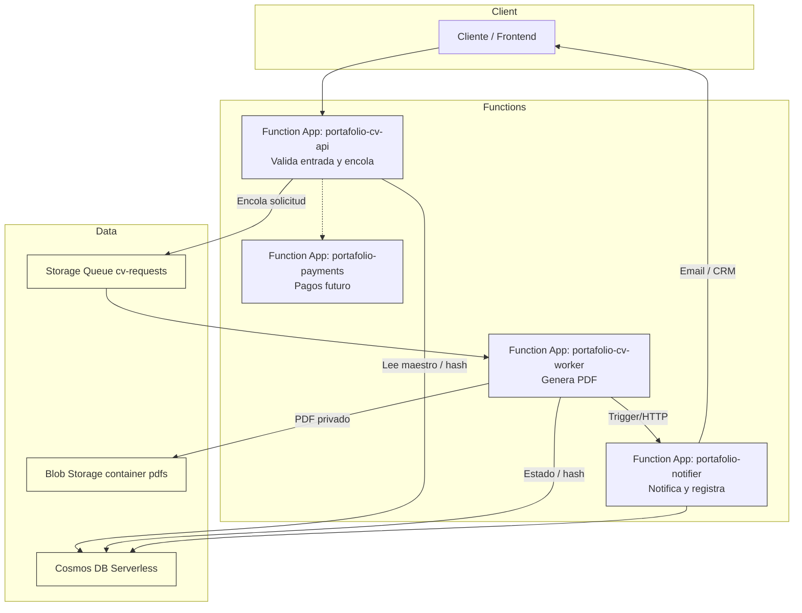

# Arquitectura Técnica — Dynamic Harvard CV Engine

## Resumen
Arquitectura serverless event-driven mínima en Azure. La infraestructura creada por Terraform incluye:
- Resource Group y App Service Plan Linux (SKU F1) compartido para Functions.
- Cuenta de Storage con contenedor `pdfs`, cola `cv-requests` y política de lifecycle para purgar PDF en 1 día.
- Identidad Administrada asignable a las Functions.
- Cosmos DB en modo Serverless para datos maestros y metadatos.
- Function Apps: `portafolio-cv-api`, `portafolio-cv-worker`, `portafolio-payments`, `portafolio-notifier` (runtime Node configurable).

## Flujo principal (Mermaid)

## Notas de diseño
- Idempotencia: almacenar hash en Cosmos para evitar reprocesos y servir respuestas rápidas.
- Seguridad: Managed Identity para Functions; blobs privados con SAS de corta vida; cola y storage sólo accesibles por la identidad.
- Coste: Cosmos en Serverless y plan F1 para Functions en desarrollo; considerar consumo o EP1 al pasar a prod.

## Repositorios relacionados
- `portafolio-iac-core-v1` — Infraestructura (este repo).
- `portafolio-db-cv-data-v1` — Datos maestros en Cosmos.
- `portafolio-functionapp-cv-api-v1` — API (orquestación + cola).
- `portafolio-functionapp-cv-worker-v1` — Worker de generación de PDF.
- `portafolio-functionapp-notifier-v1` — Notificador (email/CRM).
- `portafolio-functionapp-payments-v1` — Pagos (futuro).
- `portafolio-webapp-frontend-v1` — Frontend.

Si prefieres exportar los diagramas a SVG/PNG, avísame y los genero. 
